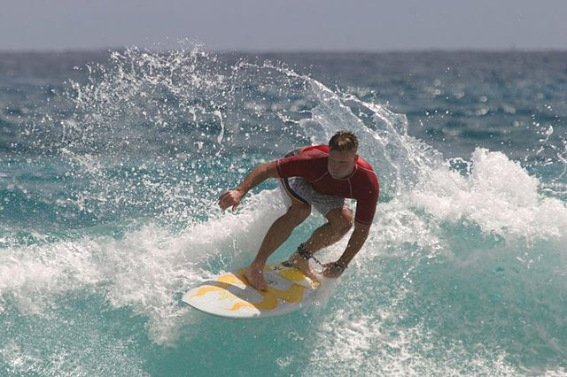

## How to use
1. Install pycoco first
```
git clone https://github.com/pdollar/coco.git
cd coco/PythonAPI/
make
python setup.py build
python setup.py install

chmod +x download.sh
./download.sh
```

2. Configure `settings.py`

3. Preprocess data
```
python build_vocab.py # produce vocab.pkl file
python resize.py # resize the image for ResNet
```
4. Train the model
```
python train.py
```

5. Evaluate model
```
python sample.py
```

## Inference


+ a person riding a wave in the ocean .
+ a person riding a wave on a wave .
+ a person riding a wave on a surfboard .


+ a giraffe standing in a giraffe standing in a field
+ a giraffe standing in a giraffe standing in a field .
+ a giraffe standing in a giraffe standing next to a tree .

## Experiments
### Scores
8208 images, MSCOCO test images
```
Bleu_1: 0.381045
Bleu_2: 0.223908
Bleu_3: 0.139023
Bleu_4: 0.090117
METEOR: 0.152553
ROUGE_L: 0.392893
CIDEr: 0.680351
```

### Output samples
```
a bathroom with a sink , toilet paper .
a group of people are playing soccer field .
a kitchen with a white cabinets and refrigerator .
a room with a sink and a sink .
a bathroom with a sink , toilet paper .
a stop sign in front of stop sign .
a red stop sign on the road sign .
a bathroom with a sink and a mirror
a bathroom with a toilet and a sink .
a kitchen with a refrigerator and black appliances .
a kitchen with a stove , sink .
a bathroom with a sink , toilet paper .
a couple of people walking on the beach .
a kitchen with a refrigerator , stove , microwave .
a couple of people standing on a beach .
a bathroom with a sink , toilet paper .
a woman sitting at a table with a table .
a woman walking down the street with an umbrella .
a man and a dog on a beach .
a man sitting in the window of a car .
a bathroom with a toilet and a sink .
a bathroom with a toilet , sink , and mirror .
a kitchen with a stove and white and white appliances .
a person is riding a bike down a street .
a brown horse standing in the grass field .
a kitchen with a stove and black stove .
a group on a skateboard in a train station .
a bathroom with a sink and sink .
a bike is parked next to the curb .
a man riding a motorcycle down a street .
```
